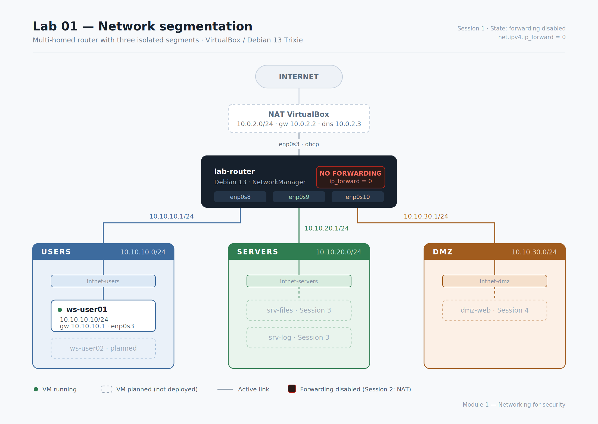

# Lab 01 — Network segmentation

Multi-homed router on Debian 13 with three isolated segments and a NAT uplink, built in VirtualBox. First practical exercise of Module 1 (Networking for security).



## What it demonstrates

Effective isolation between three zones of differing exposure levels — users, servers and DMZ — and verification of Linux kernel behaviour with IP forwarding disabled. The intended result was not full connectivity but the **intermediate state** in which the router replies from all of its addresses yet routes no traffic between them, because that contrast is what makes visible exactly what `net.ipv4.ip_forward` contributes.

## Environment

| Component | Detail |
|---|---|
| Host | Windows 11 · AMD Ryzen 16-core · 32 GB RAM |
| Hypervisor | VirtualBox |
| Guest OS | Debian 13 (Trixie) |
| Network management | NetworkManager (`nmcli`) |
| Admin workstation | macOS over SSH with an Ed25519 key |

## Segments

| Zone | Network | Gateway | Router interface |
|---|---|---|---|
| USERS | `10.10.10.0/24` | `10.10.10.1` | `enp0s8` |
| SERVERS | `10.10.20.0/24` | `10.10.20.1` | `enp0s9` |
| DMZ | `10.10.30.0/24` | `10.10.30.1` | `enp0s10` |
| NAT uplink | `10.0.2.0/24` | `10.0.2.2` | `enp0s3` (DHCP) |

Full design rationale in [`addressing.md`](addressing.md).

## Verification

From `ws-user01` (`10.10.10.10`), with `net.ipv4.ip_forward = 0`:

| Destination | Expected | Reason |
|---|---|---|
| `10.10.10.1` | Replies | Router interface in the same segment |
| `10.10.20.1` | Replies | Another interface on the same router |
| `8.8.8.8` | Silent drop | The router does not forward and emits no ICMP when dropping |

The third case is the point of the exercise: the failure produces no error. ARP resolves, the packet reaches the router, and it disappears. Distinguishing that from a `Destination Host Unreachable` — which the source machine emits when nobody answers its ARP request — narrows the problem to one side of the link or the other before touching anything.

## Repository contents

```
lab-01-networks/
├── README.md                 This document
├── topology.svg              Diagram (editable vector source)
├── topology.png              Diagram (exported)
├── addressing.md             Addressing plan and design rationale
├── logbook.md                Session record, failures and diagnosis
├── configs/                  Exported configuration from each VM
├── captures/                 Traffic evidence (ARP)
└── scripts/
    └── export-config.sh      Network state dump for a VM
```

## Reproducing

```bash
# On each VM
bash scripts/export-config.sh

# ARP capture — procedure in captures/README.md
sudo tcpdump -ni enp0s8 arp -w arp-users.pcap
```

## Status and continuation

Session 1 complete. Snapshots `sesion01-segmentos-ok` and `sesion01-cliente-ok` taken with the VMs powered off.

**Session 2:** persistent activation of `ip_forward`, outbound NAT with `nftables`, verification of the TTL drop to 63 as evidence of a routing hop, and the first inter-segment filtering rules.

> **Note:** this lab documents the state with `ip_forward = 0` — segments isolated because the router forwarded nothing. That state no longer holds. [`lab-02-nat-firewall`](../lab-02-nat-firewall/) enables forwarding and restores isolation through explicit firewall policy instead.
